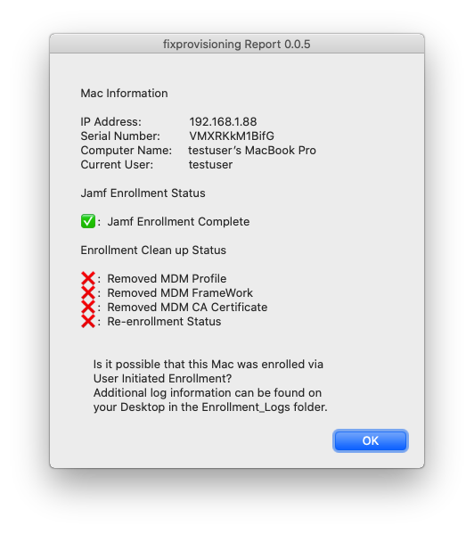

# Fix Provisioning Tool

**NOTE**: This repo is a proof of concept and is still in early stages of development. Most of the common use cases have been tested, but use with caution ...

## About this Repo

fix-provisioning-tool is a package containing a script that is intended to help remediate automated enrollment issues due to ABM communication failures or glitches during the Apple Setup Assistant process. Specifically the `Device Signature Error`.

This tool performs the following actions

- Check for the "Device Signature Error" string in the `jamf.log`. If the error is not found no actions will be taken on the Mac.
- Attempt to remove the Jamf MDM Profile, Jamf Framework, Jamf CA Certificate profile.
- Attempt to renew the device enrollment profile on the Mac and initiate automated enrollment again.
- Display a report of findings and information to direct the user/technician in the direction of a potential cause and path to resolution.
- Generate an `Enrollment_Logs` directory on the user's Desktop containing a copy of the `jamf.log`, and copies of enrollment logs in `/Library/Logs`, and a copy of the fix\_provisioning\_tool.log.

## How to Run the Tool

1. Download the latest package release from [here](https://github.com/icwfrepo/fix-provisioning-tool/releases/tag/v0.0.6).
2. Install the package and enter admin credentials. https://github.com/icwfrepo/fix-provisioning-tool/releases/download/v0.0.6/fix-provisioning-tool.pkg

    - You can run the package from anywhere but the best place is the Desktop.

3. The tool will take a few minutes to complete.
4. Take a look a the report and `Enrollment_Logs` directory on the Desktop.

## What this tool does not do ...

- It (this tool) will not catch or handle other enrollment scenarios such as loss of network connectivity during initial automated enrollment.
- It will not catch or handle errors related to downloading packages or policies from Jamf during the automated enrollment process.
- It will not attempt to reinstall software or kick off policies scoped to the Mac.
- It is not intended to be used as a remediation for failures stemming from User Initiated Enrollment. Although it will suggest if it thinks that UIE may have been used to enroll the Mac due to the `profiles renew -type enrollment` command failing to renew the device enrollment profile.

## Change Log: [Here](https://github.com/icwfrepo/fix-provisioning-tool/blob/master/CHANGELOG.md)

## ToDo

- ✅ - v0.0.2 - Add the abilty to remove the MDM certificate payload from profiles.
- ✅ - v0.0.3 - Add a UI notification at the end to let the user know what they need to do with the information gathered from the tool.
- 🔲 - Figure out how to turn this into an app.
